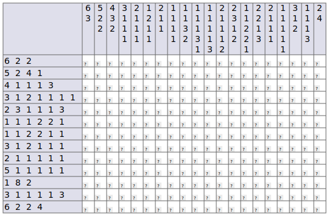
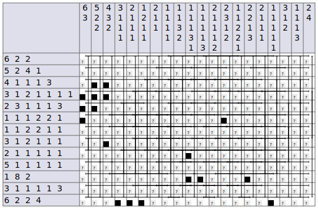
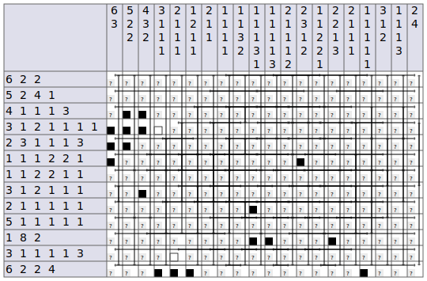
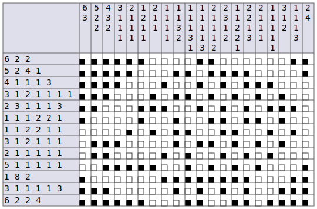
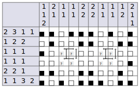

# NONOGRAM TOOL

Two programs:
* _NonoMain.exe_ program for operating on a nonogram.
* _NonoConfGen.exe_ program for creating a nonogram configuration files. 

## HOW TO COMPILE
Operating system being Linux and compiler being GCC are assumed.

To build both programs with debug information:
```bash
make all
```

To build only _NonoMain.exe_ with debug information use:
```bash
make NonoMain.exe
```

To build only _NonoConfGen.exe_ with debug information use:
```bash
make NonoConfGen.exe
```

Optimized binary is created setting DEBUG=0. For example, compile both programs optimized:
```bash
make all DEBUG=0
```

Makefile supports `clean` target.

Makefile has **NOT** implemented `install` target.

## HOW TO USE EXAMPLES
Both programs have help text which can be viewed with `-h` option:
```bash
./NonoMain.exe -h
./NonoConfGen.exe -h
```

To visualize a nonogram use `-s` option with _Nonomain.exe_. Program outputs stdout HTML with SVG image of Nonogram which can be opened by a web browser: 
```bash
./NonoMain.exe -s NonogramConfs/Logical_Solver_Test2.cfg > /tmp/nono.html
$BROWSER /tmp/nono.html
```


**NOTE**: If browser does not open the HTML files in `/tmp` then it is most like sandboxing issue. Easiest fix
is to save "nono.html" in the same folder as the program.

To apply intialization for solving or solver use `-I` option. For example, will show same nonogram as before with inital block ranges and some black pixels:
```bash
./NonoMain.exe -s -I NonogramConfs/Logical_Solver_Test2.cfg > /tmp/nono.html
$BROWSER /tmp/nono.html
```


To manually apply a rule first apply initialization with `-I` option then apply rule via `-r`. For example,
to add white pixel to row 3 and column 5, apply rule 3.1 first to refine block ranges and then colour
white pixels by rule 1.2:
```bash
./NonoMain.exe -s -I -r3.1r3 -r3.1c4 -r1.2r3 -r1.2c4 NonogramConfs/Logical_Solver_Test2.cfg > /tmp/nono.html
$BROWSER /tmp/nono.html
```


To partially solve the image use `-p` option. For example a full solution of "Logical_Solver_Test2.cfg" can be gotten:
```bash
./NonoMain.exe -s -I -p NonogramConfs/Logical_Solver_Test2.cfg > /tmp/nono.html
$BROWSER /tmp/nono.html
```


Other example which shows a partial solution rather than full one is "ElementarySwitch2.cfg":
```bash
./NonoMain.exe -s -I -p NonogramConfs/ElementarySwitch2.cfg > /tmp/nono.html
$BROWSER /tmp/nono.html
```


To count number of solution use -e (meaning _estimate_) option. This option estimates number
of solution from switching components it recognized and information number of switching components it did not.
For example "ElementarySwitch2.cfg":
```bash
./NonoMain.exe -e -I -p NonogramConfs/ElementarySwitch2.cfg
```
Output is:
```
Estimating number of solutions.
Estimated number of solutions: 4
Number of unknown proposed switching components: 0
```

Larger example with switching components which are not detected
"one_black_colourable_one_pixel_SSC_and_non_SCC_test.cfg":
```bash
./NonoMain.exe -e -I -p  NonogramConfs/one_black_colourable_one_pixel_SSC_and_non_SCC_test.cfg
```
Output is:
```
Estimating number of solutions.
Estimated number of solutions: 2880
Number of unknown proposed switching components: 4
```

To generate a column of one-black colourable one-pixel square switching components use `-g VLConcatenate`
on _NonoConfGen.exe_. Options `-n` controls the avarage size of the switching component generated and
`-m` control number switching components in the column. Output from _NonoConfGen.exe_ is written to standard
output. For example to generate column of four on avarage size 6 one-black colourable one-pixel square
switching components and counting number of switching components:
```
./NonoConfGen.exe -n6 -m4 -g VLConcatenate > /tmp/nono.conf
./NonoMain.exe -e -I -p /tmp/nono.conf
```
Output from this may include switching component that aren't recognized as generator is not perfect.
Number of solution counted also may differ as generator does random select the size of the switching
components in the column.

**NOTE**: _NonoMain.exe_ does not read UNIX pipes at the moment. 

## NONOGRAM CONFIGURATION FILE FORMAT
File format was insprited by Stabbath's program [nonogram-solver](https://github.com/Stabbath/nonogram-solver/tree/master/puzzles).
```
# I am a heading comment!
# My rows must start with '#' symbol but there can be any number of us.
# I am only comment that can exist in the file!
# AFTER ME must be only digits and newlines
5       <--- width of the nonogram
5       <--- height of the nonogram
        <--- Row with only newline
1 5     ⎫ 
2 2 2   ⎬ Column descriptions 
1 0     ⎪   Format for nonograms descriptions is 
2 1 1   ⎪   <number of blocks><space><block 0 length><space>...<space><block k length><newline>
2 1 2   ⎭   For example in C format: description of two blocks of sizes 1 and 7 is: "2 1 7\n"
        <--- Row with only newline
1 2     ⎫
2 2 2   ⎪
1 1     ⎬ Row descriptions
2 2 2   ⎪
2 2 1   ⎭   Last row in the file also ends to newline!
```

